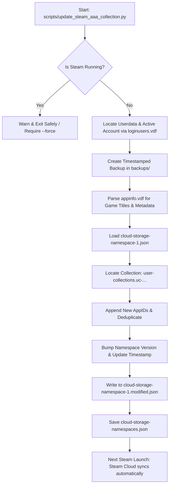

# Steam Collection Scripts 🎮

[](https://www.python.org/)
[](https://opensource.org/licenses/MIT)
[](https://github.com/vSkilled/steam_collection_scripts)

A standalone, safe, and reproducible Python toolkit for managing and automating custom collections in your Steam library. 

Specifically designed to automatically organize **major blockbuster / "AAA" games** into a dedicated collection shelf, complete with local binary caching parsing (`appinfo.vdf`), automatic Steam Cloud synchronization triggers, dry-run safety modes, and automatic timestamped backups.

---

## 📖 Background & Problem Statement

In modern versions of Steam, custom library collections are no longer simply stored in plaintext `sharedconfig.vdf` tags. Instead, Valve stores and synchronizes user collections through **Steam Cloud Storage Namespaces** (specifically namespace 1 in JSON format) and proprietary union-merge conflict resolution algorithms.

Manually adding dozens or hundreds of games to a collection through the Steam UI is tedious, click-heavy, and difficult to reproduce when setting up a new gaming PC, Steam Deck, or when bulk-organizing large game libraries (500+ titles).

This project provides an automated, programmatic way to:
1. Scan your owned library games directly from Steam's local cache.
2. Filter and categorize major titles into your custom collections (such as an `"AAA"` collection).
3. Safely inject App IDs into Steam's cloud storage state while keeping all existing entries intact.
4. Mark the updated collection for automatic Steam Cloud synchronization upon next launch.

---

## ✨ Features

- **⚡ Fast & Offline**: Reads app metadata directly from Steam's binary `appcache/appinfo.vdf` and `localconfig.vdf` in seconds without relying on external web scrapers or rate-limited APIs.
- **🛡️ Built-in Safety**:
  - Automatically detects whether the Steam client is actively running to prevent write-collisions and silent rollbacks.
  - Automatically creates a timestamped snapshot of your `cloudstorage` JSON files before modifying anything.
  - One-click rollback command (`--restore`) to revert changes if needed.
- **☁️ Cloud-Native Syncing**: Properly registers modified collection keys in `cloud-storage-namespace-1.modified.json` and increments namespace versions, prompting Steam to cleanly sync the collection to your Steam Cloud account upon launch.
- **🔍 Library Search & Querying**: Search your owned/played games by title keyword directly from the terminal with `--scan`.
- **🎯 Granular Management**: Add specific games by App ID or title, preview changes with `--dry-run`, or inspect the live contents of your collection with `--status`.

---

## 🛠️ Architecture: How It Works Under the Hood



### Key Storage Files in Modern Steam:
- `~/.local/share/Steam/userdata/<Steam3ID>/config/cloudstorage/cloud-storage-namespace-1.json`: The core JSON array containing user collection definitions (`user-collections.<id>`), showcase shelves, and news rollups.
- `~/.local/share/Steam/userdata/<Steam3ID>/config/cloudstorage/cloud-storage-namespace-1.modified.json`: Tracks which collection keys were modified locally so the Steam client knows what to push to the Steam Cloud server upon launching.
- `~/.local/share/Steam/userdata/<Steam3ID>/config/cloudstorage/cloud-storage-namespaces.json`: The local revision version map for cloud namespaces.
- `~/.local/share/Steam/appcache/appinfo.vdf`: Steam's binary format v28/v29 database containing comprehensive application names, categories, and depot information.

---

## 🚀 Installation & Quick Start

### Prerequisites
- Python 3.8 or higher.
- Standard Linux, SteamOS (Steam Deck), or Windows with Steam installed.
- No third-party Python dependencies required (uses standard library modules: `json`, `os`, `struct`, `subprocess`, `argparse`).

### Clone the Repository
```bash
git clone https://github.com/vSkilled/steam_collection_scripts.git
cd steam_collection_scripts
chmod +x scripts/update_steam_aaa_collection.py
```

---

## 💻 Usage Guide

> [!IMPORTANT]
> **Always ensure the Steam client is completely closed before applying modifications.**
> If Steam is running in the background or system tray while files are modified, Steam's in-memory state will overwrite your changes when it exits.

### 1. View Current Collection Status
Check which games are currently in your "AAA" collection:
```bash
python3 scripts/update_steam_aaa_collection.py --status
```

### 2. Preview Changes (Dry Run)
Simulate adding the curated blockbuster catalog without modifying any files:
```bash
python3 scripts/update_steam_aaa_collection.py --dry-run
```

### 3. Apply the Blockbuster / AAA Catalog
Safely add all curated AAA titles to the collection (automatically creates a backup first):
```bash
python3 scripts/update_steam_aaa_collection.py --apply
```

### 4. Add Specific Games by Title or App ID
Add individual games to the collection on demand:
```bash
# Add by Title search:
python3 scripts/update_steam_aaa_collection.py --add "Black Myth: Wukong"

# Add by Steam AppID:
python3 scripts/update_steam_aaa_collection.py --add 2358720
```

### 5. Search Your Owned Library
Quickly search for titles in your Steam library and retrieve their App IDs:
```bash
python3 scripts/update_steam_aaa_collection.py --scan "Witcher"
```

### 6. Emergency Rollback / Restore
If you ever want to revert back to before the latest modification:
```bash
python3 scripts/update_steam_aaa_collection.py --restore
```

---

## 🕹️ Curated "AAA" Catalog Breakdown

The built-in catalog targets major high-budget, acclaimed, and franchise titles, including:

| Category | Examples |
| :--- | :--- |
| **Flagship Blockbusters** | *Baldur's Gate 3, God of War, Cyberpunk 2077, Elden Ring, The Witcher 3, GTA V, Starfield, Skyrim SE, Hogwarts Legacy, Horizon Zero Dawn, Monster Hunter: World, Dark Souls III, Death Stranding, DOOM Eternal, Kingdom Come: Deliverance I & II* |
| **PlayStation / WB Action** | *Batman: Arkham Series (Asylum, City, Origins, Knight), Mad Max, Middle-earth (Shadow of Mordor, Shadow of War)* |
| **Ubisoft Flagships** | *Assassin's Creed (Valhalla, Origins, Black Flag, Rogue, Revelations, III, Mirage, Odyssey), Far Cry (3, 4, 6, Primal), Tom Clancy (The Division 1 & 2, Ghost Recon Wildlands, Rainbow Six Siege), Watch_Dogs 2* |
| **Japanese Blockbusters** | *Resident Evil 2 Remake, Resident Evil 7, Dragon Quest XI S, Dragon's Dogma, Yakuza: Like a Dragon, Tales of Arise, Metal Gear Solid V, Rise of the Tomb Raider, Deus Ex: Mankind Divided* |
| **Shooters & Sci-Fi** | *Battlefield Series (2042, 1, 4, Bad Company 2), Call of Duty: Black Ops II, Borderlands 3, Helldivers 2, Control, Alien: Isolation, The Callisto Protocol, Metro Exodus, Wolfenstein, Half-Life 2* |
| **Blockbuster Strategy & Sims**| *Civilization V & VI, Total War: WARHAMMER, Age of Empires II & III DE, Cities: Skylines I & II, Planet Zoo, Planet Coaster, Jurassic World Evolution 1 & 2, The Sims 4, Stellaris* |
| **High-Profile New / Upcoming**| *inZOI, Where Winds Meet, Crimson Desert, Path of Exile 2, Palworld* |

---

## 🗺️ Roadmap & Future Improvements

- [ ] **Interactive TUI**: Add an interactive terminal user interface (using `curses` or `textual`) to check off games with arrow keys.
- [ ] **Automated Steam Process Handling**: Option to automatically prompt to close and relaunch Steam smoothly (`steam -shutdown`).
- [ ] **Smart Rule Collections**: Implement rule-based dynamic collections based on Steam review scores, Metacritic scores, and tags.
- [ ] **Cross-Platform Path Support**: Native auto-detection paths for Windows (`%LOCALAPPDATA%\Steam\userdata`) and macOS.
- [ ] **Custom Named Collections**: Allow targeting arbitrary collection names via `--collection "RPG Classics"` or creating new collections directly from the CLI.

---

## 🤝 Contributing

Contributions, issues, and feature requests are welcome!
Feel free to check the [issues page](https://github.com/vSkilled/steam_collection_scripts/issues) if you have ideas or suggestions.

1. Fork the repository.
2. Create your feature branch (`git checkout -b feature/amazing-feature`).
3. Commit your changes (`git commit -m 'Add some amazing feature'`).
4. Push to the branch (`git push origin feature/amazing-feature`).
5. Open a Pull Request.

---

## 📄 License

This project is licensed under the MIT License - see the [LICENSE](LICENSE) file for details.

*Disclaimer: This project is not affiliated with, endorsed by, or associated with Valve Corporation or Steam. Steam is a registered trademark of Valve Corporation.*
